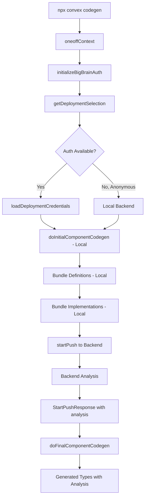
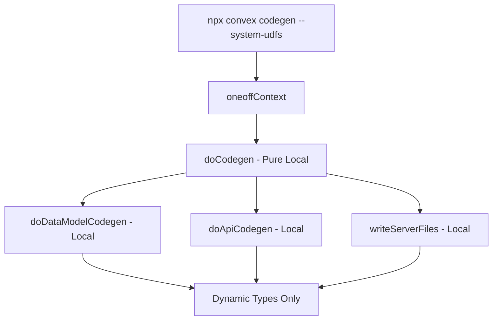

# Convex CLI: Offline Codegen Enhancement Specification

**Date:** 2025-11-21 **Status:** Proposal **Related Branch:**
`claude/convex-cli-no-auth-01YTaA2iiZgRHX9JVh4SH3qA` **Related GitHub Issue:** [#73 -
Offline development error](https://github.com/get-convex/convex-js/issues/73)

* * *

## 1. Executive Summary

**Problem:** `npx convex codegen` currently requires a backend connection and
authentication to generate TypeScript types, making it unsuitable for CI/CD pipelines
and AI agent development workflows that need offline, no-auth code generation.

**Solution:** Add an `--offline` flag to `npx convex codegen` that generates types
purely from local files without requiring backend communication or authentication.

**Key Finding:** **Offline mode provides identical type safety to backend mode** for
standard applications (without components).
The CLI already has a dynamic type generation system that uses TypeScript’s type
inference to provide full type safety from local files.

**Impact:** Enables fully offline CI/CD type checking, simplifies agent/automation
workflows, and reduces dependency on network connectivity for code generation.

* * *

## 2. Background

### 2.1 What is Convex Codegen?

Convex generates TypeScript type definitions in the `convex/_generated/` directory that
provide type-safe access to:

- **Data models** (`dataModel.ts`): Table schemas, document types, field paths, indexes

- **API functions** (`api.ts`): Query, mutation, and action function signatures

- **Server utilities** (`server.ts`): Type-safe database and utility imports

- **Components** (`component.ts`): Component-specific types for modular apps

### 2.2 What are Convex Components?

**Convex Components** are independent, modular TypeScript building blocks for your
backend. They are:

- Installed from npm (e.g., `npm install @convex-dev/auth`)

- Run in their own sandbox with their own functions, schema, and data

- Called from your app like `components.auth.signIn({ ... })`

- Similar to microservices but with transactional guarantees

**Examples:**

- Authentication: `@convex-dev/auth`

- Rate limiting: `@convex-dev/ratelimit`

- Payments: Payment processing components

- Custom components you build and publish

**Typical Usage:**
```typescript
// In your convex functions
import { components } from "./_generated/api";

export const signUp = mutation({
  handler: async (ctx, args) => {
    // Call into auth component
    await components.auth.signIn(ctx, args);
  }
});
```

Most Convex apps **do not use components** - they’re for advanced modular architectures.

### 2.3 Current Architecture

The codegen process is split into two phases:

#### Phase 1: Initial Codegen (Local)

**Location:** `src/cli/lib/codegen.ts:doInitialComponentCodegen()`

Generates **stub/placeholder** types that allow code to compile:

- Creates basic `dataModel.d.ts` with generic types

- Creates basic `api.d.ts` using `ApiFromModules<>` utility type

- Creates `server.d.ts` with standard imports

- **No backend required** - purely local file scanning

#### Phase 2: Final Codegen (Backend-Dependent)

**Location:** `src/cli/lib/codegen.ts:doFinalComponentCodegen()`

Generates **precise, analyzed** types from backend analysis:

- Bundles code locally via esbuild

- Uploads to deployment via `/api/deploy2/start_push`

- Backend analyzes schemas, validates types, extracts function signatures

- Returns `StartPushResponse` with analysis results

- Generates final types from analysis

* * *

## 3. Critical Discovery: Dynamic Mode Already Provides Full Type Safety

### 3.1 Static vs Dynamic Type Generation

Convex CLI supports two codegen modes, configured in `convex.json`:

```json
{
  "codegen": {
    "staticApi": false,        // Default: uses dynamic API codegen
    "staticDataModel": false   // Default: uses dynamic data model
  }
}
```

**The defaults are already `false`**, meaning dynamic mode is the standard!

### 3.2 How Dynamic Mode Works

#### Dynamic Data Model (Offline-Compatible)

**Location:** `src/cli/codegen_templates/dataModel.ts:74-116`

```typescript
// Generated code:
import type { DataModelFromSchemaDefinition } from "convex/server";
import schema from "../schema.js";  // ← Imports YOUR local schema!

export type DataModel = DataModelFromSchemaDefinition<typeof schema>;
// TypeScript's type system expands this to exact table/field types
```

**What this means:**

- Imports your `convex/schema.ts` file directly

- Uses TypeScript’s `DataModelFromSchemaDefinition` utility type

- TypeScript compiler extracts all table names, field types, indexes from your schema

- **Result: Identical type safety to static mode!**

#### Dynamic API (Offline-Compatible)

**Location:** `src/cli/codegen_templates/component_api.ts:358-392`

```typescript
// Generated code:
import type * as users from "../users.js";  // ← Imports YOUR local functions!
import type * as messages from "../messages.js";
import type { ApiFromModules } from "convex/server";

declare const fullApi: ApiFromModules<{
  "users": typeof users,
  "messages": typeof messages,
}>;

export declare const api: FilterApi<typeof fullApi, FunctionReference<any, "public">>;
```

**What this means:**

- Scans all `.ts`/`.js` files in your `convex/` directory

- Imports each module’s types directly

- Uses TypeScript’s type inference via `ApiFromModules` utility type

- TypeScript compiler extracts function signatures, argument types, return types

- **Result: Identical type safety to static mode!**

### 3.3 Type Safety Comparison

| Feature | Static Mode (Backend) | Dynamic Mode (Offline) |
| --- | --- | --- |
| **Requires Backend** | ✅ Yes | ❌ No |
| **Table Name Autocomplete** | ✅ Yes | ✅ Yes (identical) |
| **Document Field Types** | ✅ Yes | ✅ Yes (identical) |
| **Index Names** | ✅ Yes | ✅ Yes (identical) |
| **Field Path Types** | ✅ Yes | ✅ Yes (identical) |
| **`ctx.db.query("users")`** | ✅ Fully typed | ✅ Fully typed (identical) |
| **`Doc<"users">`** | ✅ All fields typed | ✅ All fields typed (identical) |
| **`api.users.list()`** | ✅ Typed call | ✅ Typed call (identical) |
| **Function Arguments** | ✅ Typed | ✅ Typed (identical) |
| **Function Return Types** | ✅ Typed | ✅ Typed (identical) |
| **Component Types** | ✅ Typed | ❌ `any` (see below) |
| **Error Messages** | ✅ Direct types | ⚠️ Via utility types (more verbose) |
| **Works Offline** | ❌ No | ✅ Yes |
| **CI/CD Friendly** | ⚠️ Needs deploy key | ✅ No auth needed |

**Bottom Line:** For apps without components, dynamic mode = static mode in type safety!

* * *

## 4. What You Actually Lose with Offline Mode

### 4.1 Component Type Safety (If Using Components)

**Component Imports Become `any`:**

```typescript
// With backend (static mode):
export declare const components: {
  auth: {
    signIn: FunctionReference<"mutation", { email: string, password: string }, { userId: string }>,
    signOut: FunctionReference<"mutation", {}, {}>,
  }
};

// With offline (dynamic mode):
export declare const components: AnyComponents;  // Basically `any`
```

**What This Means:**

- If you use Convex Components (modular npm packages like `@convex-dev/auth`), you lose
  type safety for `components.*` calls

- Your editor won’t autocomplete component function names

- TypeScript won’t check component function arguments/returns

- **Most apps don’t use components**, so this doesn’t affect them

**Why This Happens:**

- Components can be installed from npm as pre-built packages

- The CLI would need to analyze the component graph (which components depend on which)

- This requires executing component config files in the Convex runtime

- Can’t be done purely locally without the backend

### 4.2 Early Schema Validation (Convex Runtime Rules)

**Schema Validation Happens at Deploy Instead of Codegen:**

The backend validates **Convex-specific runtime rules** that go beyond TypeScript’s type
system:

**Examples of Runtime Validation:**
```typescript
// Invalid index name (would be caught by backend at codegen, caught at deploy in offline mode)
defineTable({
  name: v.string(),
}).index("by-name", ["name"]);  // ❌ Invalid: hyphens not allowed in index names

// Invalid search index configuration
defineTable({
  content: v.string(),
}).searchIndex("search_content", {
  searchField: "content",
  filterFields: ["invalidField"]  // ❌ Field doesn't exist
});

// Invalid table name
defineTable({
  // ...
}).tableName("My Table");  // ❌ Spaces not allowed

// Unsupported validator type
defineTable({
  data: v.any(),  // ❌ v.any() might not be supported in all contexts
});
```

**What This Means:**

- **TypeScript still validates your schema types** (field types, required vs optional,
  etc.)

- **Convex runtime rules** (valid index names, table names, configurations) are checked
  at deploy time

- You’ll catch these errors when you run `npx convex deploy` instead of at codegen time

- **This is NOT a type safety issue** - it’s a timing issue for validation

**Why This Happens:**

- Convex has runtime constraints beyond TypeScript’s type system

- The backend executes your schema in a V8 isolate to validate these rules

- Executing user code locally in a V8 isolate would be a security/complexity issue

### 4.3 Potentially More Verbose Error Messages

**Error Message Comparison:**

**Static Mode:**
```
Type 'number' is not assignable to type 'string'.
  Property 'name' in type 'users' expects type 'string'.
```

**Dynamic Mode:**
```
Type 'number' is not assignable to parameter of type
'ExtractFieldPaths<DataModelFromSchemaDefinition<typeof schema>["users"]["document"]>'.
```

**What This Means:**

- Dynamic mode uses utility types like `DataModelFromSchemaDefinition<>`

- Error messages can be longer and show intermediate types

- **The errors are still correct and actionable**

- Modern TypeScript (4.0+) has improved error messages for utility types

* * *

## 5. Use Cases

### 5.1 CI/CD Pipelines (Primary Use Case)

**Scenario:** A CI system needs to verify TypeScript types without deploying.

**Current Problems:**

- Requires `CONVEX_DEPLOY_KEY` for authentication

- Requires network access to Convex backend

- Makes deployment to verify types (wasteful)

- Fails in airgapped environments

**Desired Behavior:**
```bash
# In CI environment - no auth, no network
npx convex codegen --offline
tsc --noEmit  # Verify types locally - FULL type safety!
```

**Benefits:**

- No secrets management for basic type checking

- Faster CI runs (no network round-trip)

- Works in airgapped/offline environments

- Verifies committed `_generated/` matches source

- **Same type safety as backend mode** (for non-component apps)

### 5.2 AI Agent Development Workflows

**Scenario:** AI coding agents (like Claude Code) need to generate types frequently
during development.

**Current Problems:**

- Each codegen requires backend connection

- Agents working in sandboxed environments may lack network

- Frequent type generation creates unnecessary backend load

- Authentication adds complexity to agent workflows

**Desired Behavior:**
```bash
# Agent generates types locally as it modifies code
npx convex codegen --offline
```

**Benefits:**

- Agents can work offline/sandboxed

- No auth setup required

- Faster iteration cycles

- Reduced backend load

- **Full type safety** for agent-assisted coding

### 5.3 Local Development on Planes/Trains

**Scenario:** Developer working offline without internet.

**Current Problems:**

- Cannot generate types without backend connection

- Referenced in [Issue #73](https://github.com/get-convex/convex-js/issues/73)

**Desired Behavior:**
```bash
# Works anywhere, even on a plane
npx convex codegen --offline
```

* * *

## 6. Current Codegen Flows

### 6.1 Standard Flow (Backend-Dependent)



**Why Backend Is Currently Used:** Even though dynamic mode (the default) doesn’t
strictly need backend analysis, the CLI still calls the backend to:

1. Validate Convex-specific schema rules early

2. Validate component graph

3. Catch configuration errors before deploy

### 6.2 System UDFs Flow (Local-Only, Hidden)



**Key Difference:**

- **No backend communication**

- **No `startPush` call**

- Uses dynamic type generation only

- Flag is **hidden** (not documented for users)

- Located at: `src/cli/lib/components.ts:132-142`

* * *

## 7. Backend Analysis Deep Dive

### 7.1 What StartPushResponse Provides

**Location:** `src/cli/lib/deployApi/startPush.ts:36-49`

```typescript
export const startPushResponse = looseObject({
  environmentVariables: z.record(z.string(), z.string()),
  externalDepsId: z.nullable(z.string()),
  componentDefinitionPackages: z.record(componentDefinitionPath, sourcePackage),
  appAuth: z.array(authInfo),

  // The critical part for codegen:
  analysis: z.record(componentDefinitionPath, evaluatedComponentDefinition),

  app: checkedComponent,
  schemaChange,
});
```

### 7.2 Analysis Contents

**Location:** `src/cli/lib/deployApi/componentDefinition.ts:96-103`

```typescript
export const evaluatedComponentDefinition = looseObject({
  definition: componentDefinitionMetadata,

  // Used for staticDataModel codegen:
  schema: analyzedSchema.optional().nullable(),

  // Used for staticApi codegen:
  functions: z.record(canonicalizedModulePath, analyzedModule),

  udfConfig,
});
```

### 7.3 What Backend Actually Does

**Schema Analysis:**

1. Executes `convex/schema.ts` in a V8 isolate

2. Extracts `defineSchema({...})` result

3. Serializes validators to JSON

4. **Validates Convex-specific rules:**

   - Table names are valid

   - Index names are valid

   - Search/vector index configurations are valid

   - Validators use supported types

5. Returns structured metadata

**Function Analysis:**

1. Bundles and executes functions in isolate

2. Extracts all `query()`, `mutation()`, `action()` definitions

3. Extracts argument/return validators

4. Determines visibility (public vs internal)

5. Returns structured function metadata

**Key Insight:** The backend does **validation**, not **type inference**. The types
already exist in your local code - the backend just validates they follow Convex rules.

* * *

## 8. Local CLI Analysis Capabilities

### 8.1 What CLI CAN Do Locally

✅ **File Scanning**

- `entryPoints()` scans for all `.ts`/`.js` files in convex directory

- **Location:** `src/bundler/index.ts:294-332`

✅ **Bundling**

- esbuild bundles code with full TypeScript support

- Resolves imports, handles node modules

- **Location:** `src/bundler/index.ts:162-175`

✅ **TypeScript Type Inference**

- TypeScript compiler can infer types from code

- `ApiFromModules<>` utility type leverages this

- `DataModelFromSchemaDefinition<>` extracts schema types

- **Location:** `src/cli/codegen_templates/component_api.ts:358-392`

- **Location:** `src/cli/codegen_templates/dataModel.ts:74-116`

✅ **Schema File Reading**

- Can import and read `schema.ts` as a TypeScript module

- TypeScript type system extracts all type information

- **Location:** `src/cli/lib/codegen.ts:353`

### 8.2 What CLI CANNOT Do Locally

❌ **Convex Runtime Validation**

- Cannot validate Convex-specific schema rules in V8 isolate

- Cannot validate index names/configurations against runtime constraints

- **Reason:** Requires Convex runtime environment with security sandboxing

❌ **Component Graph Analysis**

- Cannot resolve component imports across boundaries

- Cannot analyze component configs from installed npm packages

- **Reason:** Requires executing component config files in Convex runtime

### 8.3 Why Dynamic Mode Works So Well

Dynamic mode succeeds because:

1. **TypeScript is powerful enough** - Utility types like
   `DataModelFromSchemaDefinition<>` can extract complete type information

2. **Schema is TypeScript** - Your schema file is valid TypeScript, so the TS compiler
   can analyze it

3. **Functions are TypeScript** - Function definitions are TypeScript, so types can be
   inferred

4. **No runtime needed for types** - Type checking doesn’t require executing code, just
   analyzing it

* * *

## 9. Proposed Solution: `--offline` Flag

### 9.1 User-Facing API

```bash
# Offline codegen - no auth, no network, full type safety
npx convex codegen --offline

# With typecheck (still local)
npx convex codegen --offline --typecheck enable

# Dry run to preview
npx convex codegen --offline --dry-run

# Existing flags still work
npx convex codegen --offline --init
```

### 9.2 Behavior Specification

**When `--offline` is provided:**

1. **Skip Backend Communication**

   - Do NOT call `startPush()`

   - Do NOT call `loadDeploymentCredentials()`

   - Do NOT require authentication

2. **Force Dynamic Codegen**

   - Ignore `staticApi` config (treat as `false`)

   - Ignore `staticDataModel` config (treat as `false`)

   - Use dynamic API objects (imports local files)

   - Use dynamic data model (imports local schema)

3. **Local-Only Operations**

   - ✅ Scan files with `entryPoints()`

   - ✅ Bundle locally with esbuild

   - ✅ Generate types from local TypeScript types

   - ✅ Typecheck with tsc (if `--typecheck`)

   - ✅ Write to `_generated/` directory

4. **User Communication**

   - Show info message about offline mode

   - Warn if `staticApi: true` or `staticDataModel: true` in config (ignored in offline
     mode)

   - Warn about component type safety limitation (if components detected)

   - Success message confirming types generated locally

### 9.3 Accurate Limitations & Trade-offs

**What You Lose:**

- ❌ Component type safety (if using components from npm)

  - `components.*` calls become `any`

  - Most apps don’t use components

- ⚠️ Early validation (Convex runtime rules checked at deploy instead of codegen)

  - Index name validation

  - Search/vector index configuration validation

  - Table name validation

  - Still caught when you deploy - just timing difference

- ⚠️ Potentially more verbose TypeScript errors

  - Errors still correct, just longer

**What You Keep:**

- ✅ **100% identical type safety** for your app’s functions and data (no components)

- ✅ Full TypeScript type inference from local files

- ✅ Autocomplete for tables, functions, fields

- ✅ Type-safe function calls with correct arguments/returns

- ✅ Type-safe database queries

- ✅ Fast local iteration

- ✅ CI/CD compatibility

- ✅ Works completely offline

**Recommendation:**

- Use `--offline` for CI/CD, agent workflows, and rapid local iteration

- Use normal codegen (with backend) before final deploy to catch runtime validation
  errors early

- If you don’t use components, offline mode gives you identical type safety!

* * *

## 10. Implementation Options

### Option A: Reuse Existing System UDFs Path ⭐ (RECOMMENDED)

**Approach:** Expose the existing hidden `--system-udfs` code path

**Changes Required:**

1. **Add `--offline` flag to codegen command**
   ```typescript
   // src/cli/codegen.ts
   export const codegen = new Command("codegen")
     .option(
       "--offline",
       "Generate types locally without connecting to a backend. " +
       "Uses dynamic type inference from local files. " +
       "Provides full type safety for functions and data (components become 'any'). " +
       "Ideal for CI/CD and offline development."
     )
     // ... existing options
   ```

2. **Route to local-only codegen when `--offline`**
   ```typescript
   // src/cli/lib/components.ts:96-142
   if (options.systemUdfs || options.offline) {
     // Skip backend, use local doCodegen()
     if (options.offline) {
       logMessage(
         chalk.blue("ℹ️  Offline mode: Generating types from local files")
       );
   
       if (projectConfig.codegen.staticApi || projectConfig.codegen.staticDataModel) {
         logMessage(
           chalk.yellow(
             "⚠️  Static codegen config ignored in offline mode.\n" +
             "   Using dynamic types (full type safety via TypeScript inference)"
           )
         );
       }
     }
   
     await doCodegen(ctx, functionsDirectoryPath, options.typecheck, {
       dryRun: options.dryRun,
       debug: options.debug,
       generateCommonJSApi: options.commonjs,
     });
     return;
   }
   ```

3. **Update types to include offline flag**
   ```typescript
   // src/cli/lib/codegen.ts:51-64
   export type CodegenOptions = {
     // ... existing fields
     offline?: boolean;  // NEW
   };
   ```

**File Changes:**

- `src/cli/codegen.ts` - Add flag definition (~5 lines)

- `src/cli/lib/components.ts` - Add routing logic (~15 lines)

- `src/cli/lib/codegen.ts` - Add type definition (~1 line)

- Tests: `src/cli/lib/codegen.test.ts` (new tests)

**Pros:**

- ✅ Minimal code changes (~25 lines)

- ✅ Reuses battle-tested code path

- ✅ Low risk

- ✅ Fast to implement

- ✅ Full type safety for non-component apps

**Cons:**

- ⚠️ System UDFs path may not be fully maintained (but it works)

**Estimated Effort:** 2-4 hours

* * *

### Option B: New Offline Code Path

**Approach:** Create dedicated offline codegen function

Not recommended - Option A is simpler and achieves the same result.

**Estimated Effort:** 1-2 days

* * *

### Option C: Auto-Detect No Auth

**Approach:** Automatically fallback to offline mode when no auth available

**Changes Required:**

Add auto-detection logic to `runCodegen()`:

```typescript
// src/cli/lib/components.ts
if (options.offline || options.systemUdfs) {
  // ... existing offline logic
} else if (deploymentSelection.kind === "anonymous" ||
           deploymentSelection.kind === "chooseProject") {
  // Auto-detect no backend available
  logMessage(
    chalk.blue(
      "ℹ️  No deployment configured. Using local-only codegen.\n" +
      "   Generated types have full type safety via TypeScript inference.\n" +
      "   For runtime validation, run `npx convex dev` or `npx convex deploy`.\n" +
      "   To suppress this message, use --offline flag."
    )
  );

  await doCodegen(ctx, functionsDirectoryPath, options.typecheck, {
    dryRun: options.dryRun,
    debug: options.debug,
    generateCommonJSApi: options.commonjs,
  });
  return;
}
```

**File Changes:**

- `src/cli/lib/components.ts` - Add auto-detection logic

**Pros:**

- ✅ Zero user configuration

- ✅ “Just works” in CI without flags

- ✅ Backwards compatible

- ✅ Full type safety automatically

**Cons:**

- ⚠️ Less explicit (users might not realize it’s offline)

- ⚠️ No way to force offline when auth IS available

**Estimated Effort:** 4-6 hours

* * *

### Option D: Hybrid (Auto-Detect + Flag) ⭐⭐ (BEST LONG-TERM)

**Approach:** Combine Options A and C

**Behavior:**

- Auto-detect no-auth scenarios → Use offline codegen + show info message

- `--offline` flag → Force offline codegen (even if auth available) + show info

- Normal → Use backend codegen (existing behavior)

**Decision Matrix:**

| Auth Available | `--offline` Flag | Behavior |
| --- | --- | --- |
| ❌ No | Not set | Auto offline (info message) |
| ❌ No | `--offline` | Offline (info: flag redundant) |
| ✅ Yes | Not set | Backend codegen (existing) |
| ✅ Yes | `--offline` | Force offline (info: skipping backend) |

**File Changes:**

- `src/cli/codegen.ts` - Add flag

- `src/cli/lib/components.ts` - Add routing logic for both paths

- Tests: Both auto-detect and explicit flag scenarios

**Pros:**

- ✅ Best UX: “just works” in CI

- ✅ Explicit control when needed

- ✅ Clear messaging to users

- ✅ Full type safety in all offline scenarios

- ✅ Future-proof

**Cons:**

- ⚠️ Most complex to implement

- ⚠️ More test scenarios

**Estimated Effort:** 1 day

* * *

## 11. Recommendation & Implementation Plan

### 11.1 Recommended Approach

**Start with Option A, evolve to Option D**

**Phase 1 (Immediate):** Option A - `--offline` flag

- Quick win for CI/CD use cases

- Low risk

- Can ship in days

- Full type safety for most apps

**Phase 2 (Follow-up):** Add auto-detection from Option C

- Improve UX

- Better defaults

- Ship in next release

### 11.2 Implementation Steps

#### Phase 1: `--offline` Flag (Option A)

**Step 1: Add flag definition**
```typescript
// src/cli/codegen.ts:5-42
export const codegen = new Command("codegen")
  .summary("Generate backend type definitions")
  .description(
    "Generate code in `convex/_generated/` based on the current contents of `convex/`.",
  )
  .option(
    "--offline",
    "Generate types locally without connecting to a backend. " +
    "Uses TypeScript type inference from local files. " +
    "Provides full type safety for your functions and data. " +
    "Components become 'any' (if you use them). " +
    "Ideal for CI/CD pipelines and offline development.",
  )
  // ... existing options
```

**Step 2: Route to local codegen**
```typescript
// src/cli/lib/components.ts:78-143
export async function runCodegen(
  ctx: Context,
  deploymentSelection: DeploymentSelection,
  options: CodegenOptions & { offline?: boolean },
) {
  await ensureHasConvexDependency(ctx, "codegen");
  const { configPath, projectConfig } = await readProjectConfig(ctx);
  const functionsDirectoryPath = functionsDir(configPath, projectConfig);

  if (options.init) {
    await doInitCodegen(ctx, functionsDirectoryPath, false, {
      dryRun: options.dryRun,
      debug: options.debug,
    });
  }

  // NEW: Offline mode or system UDFs
  if (options.offline || options.systemUdfs) {
    if (options.offline) {
      logMessage(
        chalk.blue("ℹ️  Offline mode: Generating types from local files\n" +
                   "   Full type safety via TypeScript inference")
      );

      if (projectConfig.codegen.staticApi || projectConfig.codegen.staticDataModel) {
        logMessage(
          chalk.yellow(
            "⚠️  Static codegen config ignored in offline mode\n" +
            "   Using dynamic types (identical type safety for non-component apps)"
          )
        );
      }

      // Check if they use components
      const componentDir = isComponentDirectory(ctx, functionsDirectoryPath, true);
      if (componentDir.kind === "ok" &&
          componentDir.component.definitionPath &&
          !componentDir.component.isRootWithoutConfig) {
        logMessage(
          chalk.yellow(
            "⚠️  Component type safety unavailable in offline mode\n" +
            "   'components.*' calls will have 'any' type\n" +
            "   Your app's functions and data remain fully typed"
          )
        );
      }
    }

    if (options.typecheck !== "disable") {
      logMessage(chalk.gray("Running TypeScript typecheck…"));
    }

    await doCodegen(ctx, functionsDirectoryPath, options.typecheck, {
      dryRun: options.dryRun,
      debug: options.debug,
      generateCommonJSApi: options.commonjs,
    });

    logFinishedStep("✓ Types generated successfully (offline mode)");
    return;
  }

  // Existing backend-based codegen
  if (!options.systemUdfs) {
    if (deploymentSelection.kind === "preview") {
      return await ctx.crash({ /* ... */ });
    }

    const selectionWithinProject =
      deploymentSelectionWithinProjectFromOptions(options);
    const credentials = await loadSelectedDeploymentCredentials(
      ctx,
      deploymentSelection,
      selectionWithinProject,
    );

    await startComponentsPushAndCodegen(/* ... */);
  }
}
```

**Step 3: Update types**
```typescript
// src/cli/lib/codegen.ts:51-64
export type CodegenOptions = {
  url?: string | undefined;
  adminKey?: string | undefined;
  dryRun: boolean;
  debug: boolean;
  typecheck: TypeCheckMode;
  init: boolean;
  commonjs: boolean;
  liveComponentSources: boolean;
  debugNodeApis: boolean;
  systemUdfs: boolean;
  offline?: boolean;  // NEW
  largeIndexDeletionCheck: LargeIndexDeletionCheck;
  codegenOnlyThisComponent?: string | undefined;
};
```

**Step 4: Pass flag through**
```typescript
// src/cli/codegen.ts:44-62
.action(async (options) => {
  const ctx = await oneoffContext(options);
  const deploymentSelection = await getDeploymentSelection(ctx, options);

  await runCodegen(ctx, deploymentSelection, {
    dryRun: !!options.dryRun,
    debug: !!options.debug,
    typecheck: options.typecheck,
    init: !!options.init,
    commonjs: !!options.commonjs,
    url: options.url,
    adminKey: options.adminKey,
    liveComponentSources: !!options.liveComponentSources,
    debugNodeApis: false,
    systemUdfs: !!options.systemUdfs,
    offline: !!options.offline,  // NEW
    largeIndexDeletionCheck: "no verification",
    codegenOnlyThisComponent: options.componentDir,
  });
});
```

**Step 5: Add tests**
```typescript
// src/cli/lib/codegen.test.ts (new tests)
test("codegen --offline works without auth", async () => {
  // Setup test context with no auth
  const ctx = testContext({ auth: null });

  // Run offline codegen
  await runCodegen(ctx, { kind: "anonymous" }, {
    offline: true,
    typecheck: "disable",
    // ... other options
  });

  // Verify _generated files created
  expect(ctx.fs.exists("convex/_generated/api.d.ts")).toBe(true);
  expect(ctx.fs.exists("convex/_generated/dataModel.d.ts")).toBe(true);
  expect(ctx.fs.exists("convex/_generated/server.d.ts")).toBe(true);

  // Verify dynamic imports are used
  const apiContent = ctx.fs.readUtf8File("convex/_generated/api.d.ts");
  expect(apiContent).toContain("ApiFromModules");

  const dataModelContent = ctx.fs.readUtf8File("convex/_generated/dataModel.d.ts");
  expect(dataModelContent).toContain("DataModelFromSchemaDefinition");
  expect(dataModelContent).toContain('import schema from "../schema.js"');
});

test("codegen --offline provides full type safety", async () => {
  // Create test project with schema and functions
  const ctx = testContext({
    files: {
      "convex/schema.ts": `
        import { defineSchema, defineTable } from "convex/server";
        import { v } from "convex/values";

        export default defineSchema({
          users: defineTable({
            name: v.string(),
            email: v.string(),
          }).index("by_email", ["email"]),
        });
      `,
      "convex/users.ts": `
        import { query } from "./_generated/server";

        export const list = query({
          args: {},
          handler: async (ctx) => {
            return await ctx.db.query("users").collect();
          },
        });
      `,
    },
  });

  await runCodegen(ctx, { kind: "anonymous" }, { offline: true });

  // Verify types generated allow full type checking
  const result = await runTypeCheck(ctx);
  expect(result.errors).toHaveLength(0);
});

test("codegen --offline warns about static config", async () => {
  const ctx = testContext({
    config: {
      codegen: { staticApi: true, staticDataModel: true }
    }
  });

  const warnings: string[] = [];
  ctx.logMessage = (msg: string) => warnings.push(msg);

  await runCodegen(ctx, { kind: "anonymous" }, {
    offline: true,
    typecheck: "disable",
  });

  expect(warnings.some(w => w.includes("Static codegen config ignored"))).toBe(true);
});

test("codegen without --offline still requires backend", async () => {
  const ctx = testContext({ auth: null });

  await expect(
    runCodegen(ctx, { kind: "chooseProject" }, {
      offline: false,
      typecheck: "disable",
    })
  ).rejects.toThrow(/no deployment/i);
});
```

**Step 6: Update documentation**
```markdown
# README.md additions

## Offline Codegen

Generate TypeScript types without backend connection:

\`\`\`bash
npx convex codegen --offline
\`\`\`

Perfect for:
- CI/CD pipelines (no auth required)
- AI agent development
- Offline development
- Fast local iteration

**Type Safety:** Offline mode provides **identical type safety** to backend mode through TypeScript's type inference. Your tables, queries, mutations, and actions are fully typed!

**Trade-offs:**
- Components (if you use them) become `any`
- Schema validation happens at deploy time instead of codegen time

**Example CI Usage:**
\`\`\`yaml
- name: Type check
  run: |
    npx convex codegen --offline
    npx tsc --noEmit
\`\`\`
```

#### Phase 2: Auto-Detection (Option C)

Add after Phase 1 is stable:

```typescript
// src/cli/lib/components.ts
if (options.offline || options.systemUdfs) {
  // ... existing offline logic
} else if (deploymentSelection.kind === "anonymous" ||
           deploymentSelection.kind === "chooseProject") {
  // Auto-detect no backend available
  logMessage(
    chalk.blue(
      "ℹ️  No deployment configured. Using local-only codegen.\n" +
      "   Generated types have full type safety via TypeScript inference.\n" +
      "   Schema validation will occur at deploy time.\n" +
      "   To suppress this message, use --offline flag."
    )
  );

  await doCodegen(ctx, functionsDirectoryPath, options.typecheck, {
    dryRun: options.dryRun,
    debug: options.debug,
    generateCommonJSApi: options.commonjs,
  });

  logFinishedStep("✓ Types generated successfully (auto-offline mode)");
  return;
}
```

* * *

## 12. Testing Strategy

### 12.1 Unit Tests

**Location:** `src/cli/lib/codegen.test.ts`

```typescript
describe("offline codegen", () => {
  test("generates api.d.ts with dynamic types", async () => {
    // Test ApiFromModules generation
  });

  test("generates dataModel.d.ts with DataModelFromSchemaDefinition", async () => {
    // Test schema import generation
  });

  test("provides full type safety for tables and functions", async () => {
    // Test actual TypeScript type checking passes
  });

  test("works without network connection", async () => {
    // Mock fetch to fail, verify codegen succeeds
  });

  test("works without authentication", async () => {
    // Context with no bigBrainAuth
  });

  test("warns about static config being ignored", async () => {
    // Test warning messages
  });

  test("warns about component type safety", async () => {
    // Test component warning when components detected
  });
});
```

### 12.2 Integration Tests

```bash
# Test in real project
cd test-project
rm -rf convex/_generated

# Should work with no auth
unset CONVEX_DEPLOY_KEY
npx convex codegen --offline

# Verify files generated
test -f convex/_generated/api.d.ts
test -f convex/_generated/dataModel.d.ts
test -f convex/_generated/server.d.ts

# Verify dynamic imports
grep -q "ApiFromModules" convex/_generated/api.d.ts
grep -q "DataModelFromSchemaDefinition" convex/_generated/dataModel.d.ts
grep -q 'import schema from "../schema.js"' convex/_generated/dataModel.d.ts

# Verify types work - full type checking
npx tsc --noEmit
```

### 12.3 CI Test Scenario

```yaml
# .github/workflows/test.yml
- name: Test offline codegen provides full type safety
  run: |
    # No CONVEX_DEPLOY_KEY set
    npx convex codegen --offline
    npm run typecheck  # Should pass with full type safety
```

* * *

## 13. Migration Guide

### 13.1 For Existing CI/CD Pipelines

**Before (requires deploy key):**
```yaml
env:
  CONVEX_DEPLOY_KEY: ${{ secrets.CONVEX_DEPLOY_KEY }}
steps:
  - run: npx convex codegen
  - run: npx tsc --noEmit
```

**After (no secrets needed, same type safety!):**
```yaml
steps:
  - run: npx convex codegen --offline
  - run: npx tsc --noEmit  # Full type safety!
```

### 13.2 For Agent Workflows

**Before:**
```bash
# Agent needs to setup auth
export CONVEX_DEPLOY_KEY="..."
npx convex codegen
```

**After:**
```bash
# Agent just runs codegen - full type safety!
npx convex codegen --offline
```

### 13.3 For Projects Using Components

**If you use Convex Components from npm:**
```bash
# Offline mode loses component type safety
npx convex codegen --offline  # components.* becomes 'any'

# For full type safety including components, use deploy key
CONVEX_DEPLOY_KEY=$KEY npx convex codegen
```

### 13.4 Backwards Compatibility

✅ **No breaking changes**

- Existing `npx convex codegen` works unchanged

- New `--offline` flag is opt-in

- Static configs still work in normal mode

- Full type safety preserved in both modes (for non-component apps)

* * *

## 14. Future Enhancements

### 14.1 Component Type Inference from npm

**Possibility:** Import component types from installed npm packages

```typescript
// Future enhancement
if (options.offline) {
  // Read component types from node_modules/@convex-dev/auth/_generated
  const componentTypes = await loadComponentTypesFromNodeModules(ctx);
  // Generate typed component imports
}
```

**Challenges:**

- Components may not ship with _generated types

- Component versions may not match

- Complex component graphs

### 14.2 Local Schema Validation

**Possibility:** Implement Convex-specific schema validation in CLI

```typescript
// Future enhancement
if (options.offline && options.validateSchema) {
  const schema = await loadLocalSchema(ctx, schemaPath);
  await validateConvexSchemaRules(schema);
  // Check index names, table names, etc.
}
```

**Benefits:**

- Catch validation errors at codegen time even in offline mode

- No need for backend round-trip just for validation

### 14.3 Cached Analysis

**Possibility:** Cache backend analysis results locally

```typescript
// Save analysis to .convex/cache/analysis.json
// Reuse when offline with freshness check
if (options.offline && cacheExists && isFresh) {
  const cachedAnalysis = loadAnalysisCache();
  // Generate types from cached analysis
}
```

**Benefits:**

- Best of both worlds: precise types + offline support

- Stale cache could show warning

* * *

## 15. Documentation Updates

### 15.1 CLI Help

```
npx convex codegen --help

Options:
  --offline            Generate types locally without connecting to backend.
                       Uses TypeScript type inference from local files.
                       Provides identical type safety for your functions and data.
                       Components (if you use them) become 'any'.
                       Ideal for CI/CD pipelines and offline development.
                       Runtime validation occurs at deploy time.
```

### 15.2 Docs Page: “Codegen in CI/CD”

**Location:** `docs.convex.dev/production/ci-cd`

```markdown
## Generating Types in CI

For type-checking in CI without deploying, use offline codegen:

```bash
npx convex codegen --offline
npx tsc --noEmit
```

This generates types from your local code without connecting to Convex.

**Type Safety:** Offline mode provides **identical type safety** to backend mode!
Your tables, queries, mutations, and actions are fully typed through TypeScript’s type
inference.

**Trade-offs:**

- ✅ No CONVEX_DEPLOY_KEY needed

- ✅ Works offline

- ✅ Fast (no network)

- ✅ Full type safety for functions and data

- ⚠️ Components (if you use them) become ‘any’

- ⚠️ Schema validation happens at deploy time

**For full validation including Convex runtime rules:**
```bash
CONVEX_DEPLOY_KEY=${{ secrets.CONVEX_DEPLOY_KEY }} npx convex codegen
```

## How It Works

Offline mode uses TypeScript’s powerful type inference:

**Data Model:**
```typescript
// Generated code
import type { DataModelFromSchemaDefinition } from "convex/server";
import schema from "../schema.js";  // Your local schema

export type DataModel = DataModelFromSchemaDefinition<typeof schema>;
// TypeScript extracts all table types, field types, indexes!
```

**API Functions:**
```typescript
// Generated code
import type * as users from "../users.js";  // Your local functions
import type { ApiFromModules } from "convex/server";

export declare const api: ApiFromModules<{ "users": typeof users }>;
// TypeScript infers all function signatures, arguments, returns!
```

Your editor gets full autocomplete and type checking!
```

---

## 16. Success Metrics

### 16.1 Adoption Metrics
- Number of projects using `--offline` flag
- Reduction in `CONVEX_DEPLOY_KEY` usage in GitHub Actions
- Community feedback on Discord/GitHub

### 16.2 Performance Metrics
- Codegen latency: Offline should be <2s vs ~5-10s for backend
- CI build time reduction

### 16.3 Quality Metrics
- No increase in type-related bugs
- User satisfaction surveys
- Support ticket reduction
- Type safety verification tests

---

## 17. Open Questions

1. **Should we make dynamic codegen even more prominent in docs?**
   - Since it provides identical type safety, maybe it should be highlighted more

2. **Should we add a `--validate-only` flag for CI?**
   - Would push to backend but not persist deployment
   - Gets full validation without side effects

3. **Should offline mode check for uncommitted _generated changes?**
   - Could warn if local types don't match committed types
   - Helps catch developer mistakes

4. **Should we validate component usage detection?**
   - Only show component warning if components are actually used
   - Parse imports to see if `components.*` is referenced

---

## 18. Related Work

- **Issue #73:** Offline development error when fetching backend releases
- **`CONVEX_AGENT_MODE=anonymous`:** Non-interactive development mode
- **Dynamic API:** Already uses `ApiFromModules<>` for type inference (default!)
- **Dynamic Data Model:** Already uses `DataModelFromSchemaDefinition<>` (default!)
- **Static codegen:** Opt-in via config, requires backend

---

## 19. Summary: What This Spec Changes About Our Understanding

**Initial Understanding (Incorrect):**
- Offline mode sacrifices type safety for convenience
- Static mode is "better" for types
- Backend analysis is necessary for correct types

**Corrected Understanding:**
- **Offline mode provides identical type safety** (for non-component apps)
- Dynamic mode (which works offline) is actually the **default**!
- Backend analysis is for **validation**, not **type inference**
- TypeScript is powerful enough to extract complete type information locally
- The only real limitation is component type safety

**Key Insight:**
The Convex team already built a fully functional offline codegen system (dynamic mode)! It's the default, it works great, and provides full type safety. We just need to make it accessible when there's no backend connection.

---

## 20. Appendix: Code Locations Reference

| Feature | File | Lines |
|---------|------|-------|
| Codegen command | `src/cli/codegen.ts` | 5-62 |
| runCodegen | `src/cli/lib/components.ts` | 78-143 |
| doCodegen (local) | `src/cli/lib/codegen.ts` | 130-200 |
| doInitialComponentCodegen | `src/cli/lib/codegen.ts` | 203-299 |
| doFinalComponentCodegen | `src/cli/lib/codegen.ts` | 318-450 |
| Dynamic API codegen | `src/cli/codegen_templates/component_api.ts` | 358-392 |
| Static API codegen | `src/cli/codegen_templates/component_api.ts` | 309-331 |
| Dynamic data model | `src/cli/codegen_templates/dataModel.ts` | 74-116 |
| Static data model | `src/cli/codegen_templates/dataModel.ts` | 127-220 |
| DataModelFromSchemaDefinition | `src/server/schema.ts` | 786-820 |
| ApiFromModules | `src/server/index.ts` | Various |
| startPush | `src/cli/lib/deploy2.ts` | 57-74 |
| StartPushResponse | `src/cli/lib/deployApi/startPush.ts` | 36-49 |
| Config parsing | `src/cli/lib/config.ts` | Various |
```
